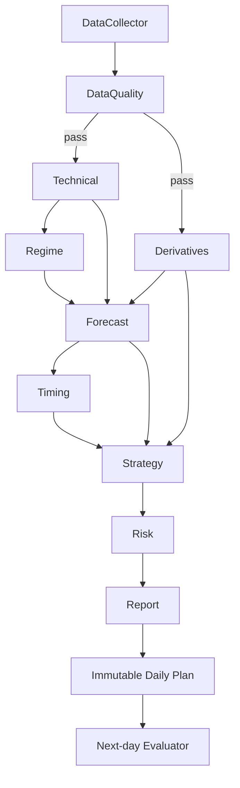

# AGENTS — MarketPilot AI

## 1. Agent philosophy
Use multiple narrow agents/services with structured inputs and outputs.

The LLM is an orchestrator/explainer, not the source of truth for prices.

## 2. Agents

### 2.1 DataCollectorAgent
Responsibilities:
- choose provider based on required capability
- fetch data
- normalize timestamps
- persist raw payload metadata
- retry transient failures

Input:
```json
{
  "instrument_id": "NSE_INDEX_NIFTY50",
  "session": "latest"
}
```

Output:
```json
{
  "status": "complete",
  "datasets": [],
  "missing": []
}
```

### 2.2 DataQualityAgent
Checks:
- latest session complete
- OHLC sanity
- missing bars
- duplicates
- timestamp alignment
- stale option chain
- expiry consistency

Can block downstream forecasting.

### 2.3 TechnicalAnalysisAgent
Produces structured:
- trend
- momentum
- volatility
- support/resistance
- indicators

No prose required internally.

### 2.4 DerivativesAnalysisAgent
Produces:
- futures basis/OI state
- PCR
- call walls
- put walls
- IV structure
- expected move
- Greeks context
- likely support/resistance from options

### 2.5 RegimeAgent
Output:
```json
{
  "regime": "BULLISH_TREND",
  "probabilities": {
    "bullish_trend": 0.61,
    "range": 0.24,
    "bearish_trend": 0.15
  }
}
```

### 2.6 ForecastAgent
Runs statistical/ML ensemble.

Outputs:
- directional probabilities
- return quantiles
- price quantiles
- uncertainty

Must not write strategy.

### 2.7 TimingAgent
Uses intraday historical distributions.

For each level:
- touch probability
- probability by time bucket
- median first-touch time
- sample count

If insufficient history:
```json
{
  "status": "INSUFFICIENT_DATA"
}
```

### 2.8 StrategyAgent
Combines:
- forecast
- regime
- technical levels
- derivatives
- risk rules

Creates:
- bull setup
- bear setup
- no-trade case

### 2.9 RiskAgent
May modify or reject a setup.

Rules:
- minimum R:R
- volatility-adjusted stop
- max distance from expected range
- minimum confidence
- event-risk override
- liquidity/spread checks

### 2.10 BacktestAgent
Replays historical signals without look-ahead bias.

Stores immutable results.

### 2.11 EvaluatorAgent
After the next session:
- scores direction
- scores ranges
- evaluates entry/stop/target
- evaluates time windows
- updates calibration reports

It must NOT rewrite the original forecast.

### 2.12 IPOResearchAgent
Inputs:
- IPO metadata
- financial statements
- valuation
- peer data
- subscription

Outputs:
- factor scores
- risk flags
- recommendation
- missing data

### 2.13 ReportAgent
Only this layer should use an LLM heavily.

Input is structured JSON from prior agents.

Output:
- concise trader brief
- reasons
- scenarios
- warnings

The ReportAgent is forbidden to invent missing numbers.

## 3. Orchestration



## 4. Agent contracts
Every agent response:
```json
{
  "agent": "ForecastAgent",
  "version": "1.0.0",
  "as_of": "...",
  "status": "OK",
  "input_hash": "...",
  "data": {},
  "warnings": []
}
```

## 5. Confidence policy
Do not allow arbitrary LLM confidence.

Confidence must come from:
- model probability
- historical calibration
- sample size
- data quality

Suggested formula:
```text
final_confidence =
  calibrated_model_probability
  × data_quality_factor
  × sample_size_factor
  × regime_stability_factor
```

## 6. Hallucination guardrails
ReportAgent prompt rules:
1. Use only supplied structured values.
2. If a field is null, say unavailable.
3. Do not fabricate news, prices, IV, OI or IPO figures.
4. Do not promise profits.
5. Do not turn probability windows into exact times.
6. Always include invalidation/no-trade condition.
7. Mention provider timestamp.

## 7. Provider selection policy
Example:
```python
if requirement == "option_chain":
    choose("upstox")
elif requirement == "official_eod_validation":
    choose("nse_reports")
elif requirement == "simple_eod":
    choose_best_available("marketstack", "upstox")
elif asset_class == "forex":
    choose("twelvedata")
```

## 8. Daily agent sequence
After market close:
1. DataCollector
2. DataQuality
3. Technical
4. Derivatives
5. Regime
6. Forecast
7. Timing
8. Strategy
9. Risk
10. Report
11. freeze plan

Next session after close:
12. Evaluator

## 9. Human control
The user can configure:
- risk profile
- preferred F&O instrument
- minimum confidence
- max trades/day
- option buying vs spreads
- expiry preference

Automatic execution is OFF by default.
