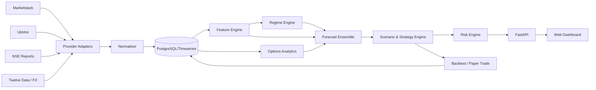

# TECH_SPEC — MarketPilot AI

## 1. Architecture



## 2. Repository layout

```text
project/
├── apps/
│   ├── api/
│   ├── worker/
│   └── web/
├── src/
│   ├── domain/
│   ├── providers/
│   │   ├── base.py
│   │   ├── marketstack.py
│   │   ├── upstox.py
│   │   ├── nse_reports.py
│   │   └── twelvedata.py
│   ├── ingestion/
│   ├── features/
│   ├── derivatives/
│   ├── regimes/
│   ├── forecasting/
│   ├── strategy/
│   ├── risk/
│   ├── backtest/
│   ├── ipo/
│   └── agents/
├── tests/
├── migrations/
├── docker/
├── PRD.md
├── REQUIREMENTS.md
├── TECH_SPEC.md
├── DATA_MODEL.md
├── API_SPEC.md
├── UI_SPEC.md
├── AGENTS.md
└── TODO.md
```

## 3. Provider interface

```python
class MarketDataProvider(Protocol):
    async def get_quote(self, instrument): ...
    async def get_historical_candles(self, instrument, interval, start, end): ...
    async def get_intraday_candles(self, instrument, interval, date): ...
    async def get_option_contracts(self, underlying, expiry=None): ...
    async def get_option_chain(self, underlying, expiry): ...
    async def get_open_interest(self, underlying, expiry, date=None): ...
```

Provider capabilities are discovered at runtime.

## 4. NIFTY canonical identifier

```yaml
instrument_id: NSE_INDEX_NIFTY50
display_name: NIFTY 50
asset_class: INDEX
exchange: NSE
currency: INR
timezone: Asia/Kolkata
upstox_key: "NSE_INDEX|Nifty 50"
```

Never scatter provider-specific symbols through strategy code.

## 5. Data ingestion

### EOD job
Trigger after final session data is expected.

Pipeline:
1. check NSE trading calendar
2. fetch latest daily candle
3. fetch historical context
4. fetch India VIX
5. fetch futures data
6. fetch nearest relevant option expiries
7. fetch option chain/OI/Greeks
8. normalize
9. validate
10. persist
11. compute features
12. run models
13. generate report
14. freeze report snapshot

### Intraday job
Phase 2:
- WebSocket primary
- REST candle reconciliation
- write 1m bars
- roll up 5m/15m locally

## 6. Feature sets

### Price features
```text
ret_1d
ret_5d
ret_20d
gap_pct
range_pct
atr_14
close_to_high
close_to_low
distance_sma20
distance_sma50
distance_sma200
rsi14
macd
adx14
bb_width
realized_vol_20
```

### Intraday features
```text
opening_gap
opening_range_15m
opening_range_break
vwap_distance
first_hour_return
time_of_day_volatility
time_of_day_high_probability
time_of_day_low_probability
```

### Options features
```text
pcr_oi
pcr_volume
atm_iv
iv_percentile
call_wall
put_wall
call_oi_change_wall
put_oi_change_wall
atm_straddle
implied_move_pct
skew_25d
gamma_cluster
```

### Context features
- India VIX
- GIFT NIFTY if provider allows
- USD/INR
- Brent
- major global index return
- event-calendar flags

These are optional features; prediction must continue gracefully when unavailable.

## 7. Model design

### 7.1 Baseline models
Before ML, establish:
- previous-day direction baseline
- SMA regime baseline
- ATR expected range baseline
- historical conditional distribution baseline

### 7.2 Classification
Predict:
`P(close_return > threshold)`, `P(range)`, `P(close_return < -threshold)`.

Candidate:
- logistic regression
- gradient boosting
- LightGBM/XGBoost

### 7.3 Range model
Predict quantiles for:
- next open
- next high
- next low
- next close

Use quantile regression rather than point-only forecasts.

### 7.4 Time-to-level model
Problem formulation:
For each proposed price level, estimate probability of first touch by each time bucket.

Time buckets:
- 09:15–09:45
- 09:45–10:30
- 10:30–11:30
- 11:30–12:30
- 12:30–13:30
- 13:30–14:30
- 14:30–15:30

Potential methods:
- empirical conditional distribution
- survival analysis
- gradient boosted survival model

Output:
```json
{
  "level": 24500,
  "touch_probability": 0.63,
  "most_likely_window": "09:45-11:30",
  "sample_count": 184
}
```

## 8. Avoid data leakage
Critical:
- Features at EOD day T may only use information known by T close.
- Tomorrow's option-chain/future data may not leak into training.
- Scaling must be fitted inside each training fold.
- Hyperparameter tuning must be nested/walk-forward.

## 9. Validation scheme
Use anchored walk-forward:

```text
Train 2018-2022 -> Test Q1 2023
Train 2018-Q1 2023 -> Test Q2 2023
...
```

For newer intraday data, start from available history and walk forward.

## 10. Metrics

### Forecast
- accuracy
- balanced accuracy
- ROC-AUC where meaningful
- log loss
- Brier score
- calibration curve
- MAE
- pinball loss for quantiles

### Strategy
- expectancy per trade
- profit factor
- maximum drawdown
- Sharpe/Sortino
- hit rate
- average win/loss
- MAE/MFE
- exposure
- turnover
- slippage sensitivity

## 11. Strategy synthesis

Pseudo-logic:

```python
if data_quality < threshold:
    return NO_FORECAST

if regime == "bullish" and p_up >= min_conf:
    candidate = long_setup()
elif regime == "bearish" and p_down >= min_conf:
    candidate = short_setup()
else:
    candidate = range_or_no_trade()

candidate = apply_options_context(candidate)
candidate = apply_expected_range(candidate)
candidate = apply_support_resistance(candidate)
candidate = risk_engine(candidate)

if candidate.expected_value <= 0:
    return NO_TRADE
```

## 12. Entry logic
Avoid raw "buy at X" without confirmation.

Example:
- forecast support: 24,460–24,500
- bullish confirmation: reclaim 24,520 + 5/15m close
- entry: 24,510–24,535
- stop: below structural invalidation
- target: resistance/quantile-based

## 13. F&O instrument selection
For directional buying:
- prefer liquid expiry
- avoid extreme spreads
- choose delta band, e.g. 0.45–0.65 depending strategy
- account for theta and IV percentile

For selling strategies:
MVP should provide research only; do not auto-enable naked option selling.

## 14. Scheduling
All timestamps internally UTC.

Display IST.

Jobs:
- 15:40 IST: initiate EOD completeness checks
- retry until provider marks latest session complete
- then generate report
- optional 08:30 IST next-day refresh for overnight context
- optional 09:05 IST pre-open update

## 15. LLM usage
The LLM **must not calculate core trading signals from prose alone**.

Structured numeric engine produces:
- features
- forecasts
- scenarios
- risk metrics

LLM responsibilities:
- explain
- summarize
- compare
- turn structured results into a readable brief

## 16. Secrets
Environment:
```text
MARKETSTACK_API_KEY=
UPSTOX_CLIENT_ID=
UPSTOX_CLIENT_SECRET=
UPSTOX_ACCESS_TOKEN=
TWELVEDATA_API_KEY=
DATABASE_URL=
```

Do not commit `.env`.

## 17. Deployment
MVP:
- Docker Compose
- API
- worker
- PostgreSQL
- web UI

Later:
- managed PostgreSQL
- object storage
- task queue
- CI/CD
- monitoring

## 18. External source notes
As of the design date:
- Marketstack free tier is EOD-focused with limited request/history allowances.
- Upstox provides APIs for NIFTY quote/history, live feeds, option contracts, option chain, OI and IPOs.
- NSE publishes official derivatives reports including UDiFF bhavcopy and participant/FII data.
- Twelve Data provides forex time series and can be added through the generic provider interface.

Provider terms, quotas and entitlements must be rechecked at implementation time.
